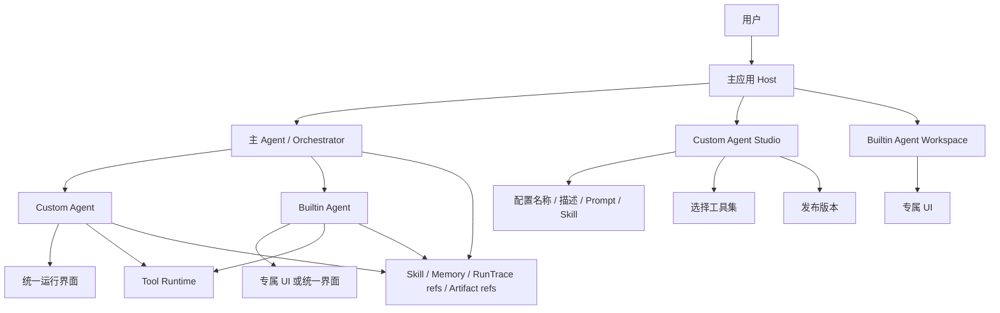
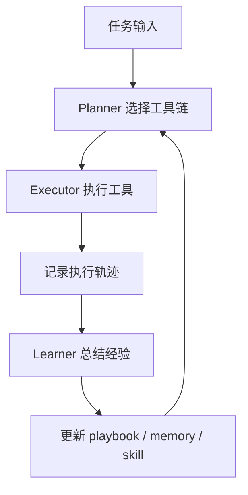
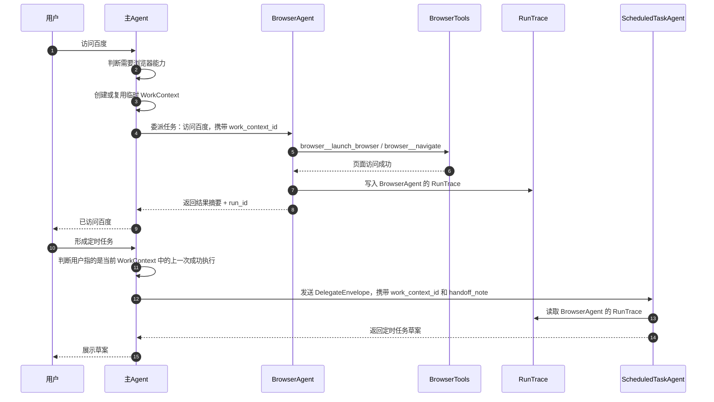

# Agent 平台设计草案

本文档用于记录后续 Agent 平台化建设的设计方向，便于持续迭代。当前目标不是一次性实现全部能力，而是先把核心边界、对象模型和落地顺序定清楚。

实现决策：

- Agent Platform 主服务切到 Node.js / TypeScript 从零实现。
- 推荐使用 Fastify + Drizzle + Zod。
- 模型接入采用 Provider Adapter，默认 Kimi 2.5；OpenAI 作为可选 provider，不作为第一阶段必需依赖。
- 旧 Python 后端暂时不承载新 Agent Platform 主实现，只保留现有系统能力。
- Python 后续可作为工具 Worker 接入，用于复杂文档解析、浏览器自动化、OCR、数据分析等能力。
- 本文档的对象模型仍然有效，具体落地以 Node / TypeScript 版本为准。

## 1. 产品目标

系统未来会支持两类 Agent：

- 自定义专职 Agent：用户在前端创建，选择工具、编写 skill、配置职责，使用统一固定运行界面。
- 内置专职 Agent：系统预置的高频核心 Agent，例如剪辑 Agent、爬虫 Agent、定时任务 Agent，可以拥有独立 UI 和更深的工作流。

每个 Agent 都应该支持：

- 独立给用户使用。
- 被主 Agent 调度协作。
- 拥有自己的工具集。
- 拥有自己的 skill。
- 按版本发布。
- 每次运行冻结工具和 skill 快照。
- 通过历史执行记录逐步沉淀经验。

## 2. 核心原则

- 主 Agent 是编排器，不是万能执行者。
- 专职 Agent 负责明确领域内的任务。
- 自定义 Agent 能力可配置，但界面固定。
- 内置 Agent 可以拥有独立 UI。
- 工具注册不等于暴露给所有 Agent。
- Agent 运行时只暴露当前版本允许的工具。
- 工具集、prompt、skill、运行策略都要版本化。
- 正在运行的任务使用启动时快照，不受后台配置变更影响。
- Agent 之间协作时尽量使用结构化任务协议，而不是只靠自然语言转述。

## 3. Agent 类型

### 3.1 Custom Agent

Custom Agent 由用户在前端创建和维护。

能力：

- 配置名称、描述、职责说明。
- 编写 system prompt 或 skill。
- 从后端允许的工具目录中选择工具。
- 使用统一运行界面。
- 可以独立运行。
- 可以被主 Agent 当作子 Agent 调用。
- 可以发布新版本。

适用场景：

- 用户自定义工作流。
- 长尾业务场景。
- 快速试验新的工具组合。
- 不需要专属 UI 的专业任务。

### 3.2 Builtin Agent

Builtin Agent 由系统内置。

能力：

- 可以使用统一界面，也可以绑定专属 UI。
- 可以拥有更固定的 workflow。
- 可以使用更深的业务服务。
- 可以被主 Agent 调度。
- 可以独立打开工作台。

示例：

- 剪辑 Agent：素材区、时间轴、预览、导出。
- 爬虫 Agent：URL 队列、页面预览、数据表、运行日志。
- 定时任务 Agent：草案、日程、预览、确认、运行记录。
- 知识库 Agent：检索、引用、摘要、文档溯源。

## 4. 总体架构



## 5. 关键对象

### 5.1 AgentManifest

AgentManifest 描述一个 Agent 当前可运行的定义。

示例：

```json
{
  "agent_id": "crawler_custom_001",
  "name": "商品采集 Agent",
  "type": "custom",
  "description": "负责采集商品页面并整理结构化数据",
  "version": 3,
  "status": "published",
  "standalone_enabled": true,
  "subagent_enabled": true,
  "ui_mode": "generic",
  "ui_route": null,
  "system_prompt": "...",
  "skill_text": "...",
  "tool_profile_id": "profile_123",
  "memory_policy": "agent_session",
  "max_steps": 10,
  "output_schema": {},
  "created_by": 1
}
```

内置 Agent 示例：

```json
{
  "agent_id": "builtin_video_editor",
  "name": "剪辑 Agent",
  "type": "builtin",
  "version": 1,
  "standalone_enabled": true,
  "subagent_enabled": true,
  "ui_mode": "custom",
  "ui_route": "/agents/video-editor",
  "tool_profile_id": "video_editor_default"
}
```

### 5.2 ToolProfile

ToolProfile 描述某个 Agent 在某个版本中允许使用的工具集。

示例：

```json
{
  "tool_profile_id": "profile_123",
  "agent_id": "crawler_custom_001",
  "version": 3,
  "allowed_tools": [
    "browser__launch_browser",
    "browser__navigate",
    "browser__get_text",
    "network__http_get"
  ],
  "blocked_tools": [],
  "risk_level": "medium",
  "requires_confirmation": false
}
```

规则：

- 前端只能从后端允许的工具目录中选择工具。
- 后端负责最终权限校验。
- Agent 运行时只向 LLM 暴露 ToolProfile 中允许的工具。
- 工具集变更需要发布新版本。
- 删除工具时优先禁用或移出 profile，不建议直接物理删除。

### 5.3 Skill

Skill 是 Agent 的经验和工作方法。它可以由用户编写，也可以由系统从历史执行中总结。

来源：

- user_written：用户手写。
- learned：系统从执行轨迹中提炼。
- builtin：系统内置。

示例：

```json
{
  "skill_id": "skill_001",
  "agent_id": "crawler_custom_001",
  "version": 2,
  "source": "user_written",
  "title": "商品页面采集流程",
  "content": "先打开页面，等待加载，再提取正文和价格区域...",
  "recommended_tools": [
    "browser__navigate",
    "browser__get_text"
  ],
  "failure_fallbacks": [
    "如果 browser 获取失败，尝试 network__http_get"
  ],
  "confidence": 0.8
}
```

Skill 可以包含：

- 适用场景。
- 推荐工具链。
- 参数偏好。
- 成功标准。
- 失败兜底策略。
- 输出格式要求。

### 5.4 AgentRunSnapshot

每次 Agent 运行前都需要冻结快照。

示例：

```json
{
  "run_id": "run_001",
  "agent_id": "crawler_custom_001",
  "agent_version": 3,
  "tool_profile_version": 3,
  "tools_snapshot": [
    "browser__navigate",
    "browser__get_text"
  ],
  "skill_snapshot": "...",
  "system_prompt_snapshot": "...",
  "input": {},
  "created_at": "..."
}
```

作用：

- 保证运行过程稳定。
- 支持历史回放。
- 便于排查当时使用的 prompt、skill、工具集。
- 避免后台配置变更影响正在运行的任务。

## 6. UI 设计方向

### 6.1 自定义 Agent 统一界面

Custom Agent 使用固定运行界面。

建议区域：

- Agent 信息区：名称、版本、状态、描述。
- 输入区：用户任务输入。
- 对话区：Agent 回复和用户追问。
- 工具区：当前允许工具列表。
- 执行区：步骤、工具调用、状态、错误信息。
- 产物区：文件、数据集、链接、报告等。
- Skill 区：当前 skill 内容和版本。

### 6.2 内置 Agent 专属 UI

Builtin Agent 可以拥有专属工作台。

示例：

- 剪辑 Agent：素材库、时间轴、预览窗口、字幕轨、导出按钮。
- 爬虫 Agent：URL 队列、抓取进度、页面预览、结构化结果表。
- 定时任务 Agent：草案卡片、日程配置、预览、确认、运行历史。

### 6.3 主 Agent 调度视图

主 Agent 可以在聊天中展示子 Agent 调用卡片。

卡片内容：

- 子 Agent 名称。
- 当前状态。
- 输入摘要。
- 运行步骤。
- 结果摘要。
- 产物入口。
- 跳转到独立工作台的入口。

## 7. Agent 协作协议

主 Agent 委派子 Agent 时，建议使用轻量 DelegateEnvelope。第一版不强制每个 Agent 额外维护 input contract；Agent 的 description 和 skill 负责说明它能做什么、如何理解任务、需要什么上下文、缺失时如何处理。

主 Agent 委派前应读取候选 Agent 的 description 和 skill，判断是否应该交给该 Agent。主 Agent 不把任务拆成目标 Agent 的完整工具参数；子 Agent 接到委派后，通过自己的 LLM 和 ContextPolicy 理解用户目标、读取上下文、判断是否缺少关键参数。

请求：

```json
{
  "delegate_id": "del_crawler_001",
  "source_agent_id": "main_agent",
  "target_agent_id": "crawler_custom_001",
  "mode": "subagent",
  "work_context_id": "wc_001",
  "user_message": "抓取这个网站的商品信息",
  "handoff_note": "用户希望抓取当前工作上下文中的网站商品信息。请自行读取 WorkContext 中的 URL、已有页面信息或相关 Artifact；如果缺少入口 URL 或采集范围，返回澄清请求。",
  "authority": {
    "scope": "work_context",
    "can_read": ["work_context", "run_trace", "artifact", "scoped_memory"],
    "can_write": ["agent_run", "agent_run_step", "artifact"]
  },
  "expected_result": "crawl_result_or_clarification"
}
```

响应：

```json
{
  "status": "success",
  "summary": "已采集 50 条商品数据",
  "artifacts": [
    {
      "type": "dataset",
      "id": "artifact_001"
    }
  ],
  "tool_trace": []
}
```

协作模式：

- 串行协作：一个 Agent 的结果作为下一个 Agent 的输入。
- 并行协作：多个 Agent 同时处理不同子任务。
- 主控协作：主 Agent 持续观察子 Agent 状态并决定下一步。

## 8. Skill 成长闭环

Agent 的 skill 应来自执行经验，而不是只靠 prompt。

闭环：



每次运行后建议记录：

- 用户目标。
- 选择的工具。
- 工具调用顺序。
- 每步输入输出。
- 成功或失败。
- 失败原因。
- 最终结果。
- 下次建议。

可沉淀内容：

- 成功工具链。
- 常用参数模板。
- 失败兜底策略。
- 任务模板。
- 禁用或低效工具组合。

## 9. 主 Agent 与子 Agent 的语义委派

主 Agent 委派子 Agent 不是函数调用，而是语义任务交接。

主 Agent 不应该把用户目标提前拆成目标 Agent 的完整工具参数，也不应该把一组 context_refs 精准喂给子 Agent 当作唯一输入。子 Agent 拥有自己的 LLM、上下文读取策略和工具使用能力，应在授权范围内自行理解任务、读取上下文、判断参数是否充足，并决定调用工具或返回澄清请求。

推荐模型：

- 主 Agent 持有当前用户会话的大局视角。
- 主 Agent 通过自己的 LLM、skill、playbook 和 Agent Registry 判断是否需要委派，以及委派给哪个 Agent。
- 主 Agent 负责确定当前 WorkContext，并把用户原话和必要交接说明交给子 Agent。
- 子 Agent 通过自己的 LLM 和 ContextPolicy 读取 WorkContext 下被授权的 RunTrace、Artifact 和 Scoped Memory。
- 子 Agent 自己判断是否缺少关键参数；如果缺少，返回 needs_clarification，由主 Agent 面向用户追问。
- 子 Agent 执行完成后返回结构化结果，再由主 Agent 挂回当前会话。

核心原则：

- 委派是语义任务交接，不是 RPC 或工具函数调用。
- 主 Agent 不替子 Agent 生成完整业务参数。
- 主 Agent 不默认传 context_refs；常规委派只传 work_context_id，由子 Agent runtime 自行按策略读取。
- 主 Agent 负责消解用户语言中的指代和上下文。
- 子 Agent 负责专业理解、专业规划和工具调用。
- 子 Agent 可以返回结构化结果，也可以返回需要澄清的问题。
- 记忆通过 policy 检索，不自动全量共享。
- RunTrace 和 Artifact 是跨 Agent 协作的核心媒介。

MainAgent 的 LLM + skill / playbook 是编排大脑；`orchestration.service.ts` 不是决策引擎。`orchestration.service.ts` 只负责执行和记录 MainAgent 已经决定的编排动作，例如创建或复用 WorkContext、生成 DelegateEnvelope、记录 OrchestrationEvent、启动子 Agent run、挂载 RunTrace 和 Artifact、处理 needs_clarification。

### 9.1 MainAgent Session Context

主 Agent 每轮处理用户消息前，应先读取当前 MainSession 下的 WorkContext 概览，而不是依赖全量聊天历史或模型短期记忆。

读取范围建议：

- 当前 session 下 active / waiting_user / paused / recently_completed 的 WorkContext。
- 每个 WorkContext 的 title、goal_text、status、stage、progress_summary、next_action。
- 每个 WorkContext 最近的重要 run_refs 和 artifact_refs 摘要。
- 最近几个 OrchestrationEvent 摘要。
- 当前 UI 选中的 work_context_id，如果有。
- 用户当前消息。

第一版查询可以很简单：

```sql
select *
from work_contexts
where session_id = :current_session_id
  and status in ('active', 'waiting_user', 'paused', 'completed')
order by last_active_at desc
limit 10;
```

组装给 MainAgent LLM 的上下文示例：

```json
{
  "session_id": "sess_001",
  "work_contexts": [
    {
      "work_context_id": "wc_product_page",
      "title": "产品网页视觉升级与还原",
      "status": "active",
      "stage": "frontend_reconstruction",
      "progress_summary": "已生成初版网页、优化 UI 图和 UI 规范。",
      "next_action": "委派 CodexAgent 还原页面",
      "latest_artifacts": [
        {
          "artifact_id": "artifact_ui_design",
          "role": "target_design",
          "summary": "优化后的产品页 UI 设计图"
        },
        {
          "artifact_id": "artifact_ui_spec",
          "role": "implementation_spec",
          "summary": "根据 UI 设计图生成的完整 UI 规范"
        }
      ]
    }
  ],
  "current_user_message": "继续把那个页面还原出来"
}
```

MainAgent 的 LLM + skill 基于这个 Session Context 判断：

- 复用哪个 WorkContext。
- 是否创建新的 WorkContext。
- 是否需要向用户澄清。
- 是否委派子 Agent。

判断完成后，MainAgent 再调用 `orchestration.service.ts` 执行对应动作。

### 9.2 PromptContext 与 ContextBuilder

聊天的一问一答需要完整保存，但不应该每次完整传给 LLM。每次模型调用前，Runtime 应通过 ContextBuilder 动态生成本次 PromptContext。

核心原则：

- `chat_messages` 是原始会话事件记录，用于审计、回放和摘要来源。
- `conversation_summary` 是长会话压缩结果，用于承接超出上下文窗口的历史。
- `WorkContext` 是当前工作目标的结构化状态，不等于聊天全文。
- `RunTrace` 是执行事实记录，按需摘要或按引用读取。
- `Artifact` 是产物资源，通常先注入摘要和引用，必要时再读取原文或文件。
- `Memory` 是从用户表达、RunTrace、Artifact 或长期协作中提炼出的稳定认知。
- `PromptContext` 是一次模型调用前临时组装出的上下文包，不是长期存储的完整对象。

推荐流程：

```text
chat_messages / conversation_summary
        + WorkContext
        + RunTrace refs
        + Artifact refs
        + Scoped Memory
        + AgentVersion snapshot
        + DelegateEnvelope or current user message
                  |
                  v
            ContextBuilder
                  |
                  v
            PromptContext
                  |
                  v
                 LLM
```

PromptContext 通常包括：

- system prompt、skill、AgentVersion snapshot。
- 当前用户消息或 DelegateEnvelope。
- 最近少量关键对话。
- conversation_summary。
- 当前 WorkContext 摘要。
- 与当前任务相关的 RunTrace 摘要。
- 与当前任务相关的 Artifact 摘要和引用。
- 按 scope 和相关性检索到的少量 Memory。
- 当前 Agent 可用工具说明。
- 输出 schema 或返回格式要求。

不应默认注入：

- 全量聊天历史。
- 当前会话下所有 WorkContext。
- 所有 RunTrace 详细步骤。
- 所有 Artifact 原文。
- 所有 Memory。
- 与当前 Agent 无关的工具说明。

PromptContext 示例：

```ts
type PromptContext = {
  agent_version_snapshot: AgentVersionSnapshot;
  current_user_message?: ChatMessage;
  delegate_envelope?: DelegateEnvelope;
  recent_messages?: ChatMessage[];
  conversation_summary?: string;
  work_context_summary?: WorkContextSummary;
  run_trace_summaries?: RunTraceSummary[];
  artifact_summaries?: ArtifactSummary[];
  memory_summaries?: MemorySummary[];
  tool_manifest?: ToolManifest;
  output_schema?: unknown;
  token_budget: {
    max_context_tokens: number;
    reserved_output_tokens: number;
  };
};
```

ContextBuilder 需要做的事：

- 根据当前 Agent、用户消息、work_context_id 和 ContextPolicy 判断读取范围。
- 从最近聊天中选择少量必要消息。
- 长历史优先使用 conversation_summary。
- 只读取当前 WorkContext 下相关 refs。
- 对 RunTrace、Artifact、Memory 做相关性筛选和摘要。
- 记录本次 PromptContext 的摘要和 selected_context_refs，写入 ModelInvocation，便于复盘。

持久化建议：

- `main_sessions`：保存一次主会话入口、最近 work_context refs、最近 run refs、最近 artifact refs 和当前 UI 选择。
- `chat_messages`：保存用户消息、assistant 回复、系统提示、澄清问题和用户确认等原始对话事件。
- `conversation_summaries`：保存滚动摘要，可按 session、时间窗口或消息范围生成。
- `model_invocations`：保存本次模型调用的 request / response 摘要、PromptContext 摘要和 selected_context_refs。

这些表不要求第一阶段全部实现。第一阶段可以先通过 `agent_runs.session_id` 和 `model_invocations` 记录最小闭环，等主 Agent 会话产品化时再补 `main_sessions`、`chat_messages` 和 `conversation_summaries`。

这套机制与 Codex 类 Agent 的处理方式一致：完整历史持久化，模型调用前动态构造上下文；长历史靠摘要承接，任务状态靠 WorkContext 承接，执行事实靠 RunTrace 承接，长期经验靠 Memory 承接。

### 9.3 主 Agent 与子 Agent 的 PromptContext 区别

每个 Agent 都可以拥有自己的 LLM，但主 Agent 和子 Agent 传给 LLM 的上下文目标不同。

核心区别：

```text
MainAgent PromptContext
  目标：理解用户意图、判断当前属于哪个 WorkContext、决定是否委派、委派给谁、是否追问。

SubAgent PromptContext
  目标：理解被委派的专业任务、读取授权上下文、决定工具调用、执行任务、返回结果或澄清。
```

主 Agent 的 PromptContext 偏全局调度视角，通常包括：

- 主 Agent system prompt、skill、playbook。
- 当前用户消息。
- 最近少量聊天记录。
- conversation_summary。
- 当前 session 下 active / waiting / paused / recently_completed 的 WorkContext 概览。
- 当前 UI 选中的 work_context_id 或 artifact_id。
- 最近 OrchestrationEvent 摘要。
- 最近子 Agent 返回结果摘要。
- 少量 user / session scoped memory。
- 可委派 Agent 列表和能力摘要。

主 Agent 不应默认读取：

- 每个 RunTrace 的完整工具步骤。
- 所有 Artifact 原文。
- 所有子 Agent 详细日志。
- 所有 Memory。
- 所有文件内容。

主 Agent 的 LLM 主要判断：

- 用户当前指令属于哪件工作。
- 复用 WorkContext、创建新 WorkContext，还是需要澄清。
- 是否委派子 Agent。
- 委派给哪个 Agent。
- 给子 Agent 什么自然语言交接说明。
- 子 Agent 返回后如何面向用户总结或追问。

子 Agent 的 PromptContext 偏专业执行视角，通常包括：

- 子 Agent 自己的 system prompt、skill、AgentVersion snapshot。
- DelegateEnvelope。
- user_message、handoff_note、authority、expected_result。
- 当前 WorkContext 摘要。
- 当前 WorkContext 下与任务相关的 RunTrace 摘要或 replayable steps。
- 当前 WorkContext 下与任务相关的 Artifact 摘要或内容。
- 授权范围内的少量 Memory。
- 当前 Agent 可用工具说明。
- 输出 schema。

子 Agent 不应默认读取：

- 整个聊天历史。
- 当前 session 下所有 WorkContext。
- 其他子 Agent 的无关日志。
- 用户所有长期记忆。
- 未授权 Artifact。
- 主 Agent 的内部推理过程。

子 Agent 的 LLM 主要判断：

- 自己被委派做什么。
- 当前信息是否足够。
- 如果缺少关键参数，应返回什么 `needs_clarification`。
- 应读取哪些 RunTrace / Artifact / Memory。
- 应调用哪些工具。
- 最终返回什么结构化结果。

推荐类型：

```ts
type PromptContext = {
  context_role: "main_orchestration" | "subagent_execution";

  agent_identity: AgentIdentity;
  agent_version_snapshot: AgentVersionSnapshot;

  current_user_message?: ChatMessage;
  delegate_envelope?: DelegateEnvelope;

  recent_messages?: ChatMessage[];
  conversation_summary?: string;

  session_work_contexts?: WorkContextBrief[];
  work_context_summary?: WorkContextSummary;

  orchestration_events?: OrchestrationEventSummary[];
  run_trace_summaries?: RunTraceSummary[];
  artifact_summaries?: ArtifactSummary[];
  memory_summaries?: MemorySummary[];

  available_agents?: AgentCapabilitySummary[];
  tool_manifest?: ToolManifest;
  output_schema?: unknown;
};
```

权限规则：

- `context_role = main_orchestration`：允许读取 session 级概览、多 WorkContext 概览、Agent Registry 和少量用户级记忆。
- `context_role = subagent_execution`：只允许读取 DelegateEnvelope 授权范围内的 WorkContext、RunTrace、Artifact 和 Memory。

主 Agent 不把自己的 PromptContext 整包塞给子 Agent。正确链路是：

```text
MainAgent PromptContext
        |
        v
MainAgent LLM 决定委派
        |
        v
DelegateEnvelope
        |
        v
SubAgent ContextBuilder
        |
        v
SubAgent PromptContext
        |
        v
SubAgent LLM
```

因此，主 Agent 的上下文用于判断和编排；子 Agent 的上下文用于理解和执行。两者都由 ContextBuilder 组装，但使用不同的 context_role、ContextPolicy 和权限边界。

### 9.4 DelegateEnvelope

主 Agent 委派子 Agent 时，默认使用轻量 DelegateEnvelope。

字段建议：

- delegate_id。
- source_agent_id。
- target_agent_id。
- mode：subagent / standalone。
- work_context_id。
- user_message：用户原始指令。
- handoff_note：主 Agent 的简短自然语言交接说明。
- authority：读取和写入边界。
- expected_result：期望返回类型，例如 draft_or_clarification。
- routing：可选，记录为什么委派给该 Agent，不作为业务执行参数。

示例：

```json
{
  "delegate_id": "del_123",
  "source_agent_id": "main_agent",
  "target_agent_id": "scheduled_task_agent",
  "mode": "subagent",
  "work_context_id": "wc_001",
  "user_message": "每天8点收集信息到表格中去",
  "handoff_note": "用户刚才在当前工作中进行了信息查询，现在希望形成每天8点收集信息到表格的任务。请自行读取当前 WorkContext 判断是否信息足够；如不明确，返回需要澄清的问题。",
  "authority": {
    "scope": "work_context",
    "can_read": ["work_context", "run_trace", "artifact", "scoped_memory"],
    "can_write": ["agent_run", "agent_run_step", "scheduled_task_draft"]
  },
  "expected_result": "scheduled_task_draft_or_clarification",
  "routing": {
    "reason": "用户要求将当前信息收集工作转为定时任务",
    "confidence": 0.87
  }
}
```

### 9.5 子 Agent 上下文读取

子 Agent 接到 DelegateEnvelope 后，不直接把整个会话塞进 LLM，也不只依赖 user_message。运行时应根据 target_agent_id、work_context_id、authority 和自身 ContextPolicy 组装上下文包。

上下文包通常包括：

- 子 Agent 自己的 system prompt / skill / version snapshot。
- DelegateEnvelope 中的 user_message、handoff_note、authority 和 expected_result。
- 当前 WorkContext 摘要、状态、sub_tasks 和最近引用。
- 当前 WorkContext 下与任务相关的 RunTrace 摘要或 replayable steps。
- 当前 WorkContext 下相关 Artifact 摘要。
- 按 scope 和相关性检索到的少量 Scoped Memory。
- 当前 AgentVersion 允许的工具和工具调用边界。
- 子 Agent 的输出 schema。

子 Agent 的 LLM 基于这些内容判断：

- 是否可以直接执行。
- 需要读取哪些 RunTrace / Artifact / Memory。
- 是否缺少关键参数。
- 应调用哪些工具。
- 应返回结果还是 needs_clarification。

### 9.6 ContextRef 的定位

ContextRef 不是常规委派的必填项。

常规情况下，主 Agent 传 work_context_id，子 Agent runtime 根据自身 ContextPolicy 在该 WorkContext 范围内读取上下文。

ContextRef 只用于更精确的授权或跨边界引用：

- 跨 WorkContext 引用某个 RunTrace 或 Artifact。
- UI 中用户明确选中了某个文件、截图或数据集。
- ProjectContext 中明确选择某个资源。
- 主 Agent 检索到某个外部资源，需要显式授权子 Agent 读取。
- 权限策略要求只暴露少数 refs，而不是整个 WorkContext。

即使传递 ContextRef，它也只是授权和定位线索，不是把子 Agent 降级成函数调用。

### 9.7 不同 Agent 的 Context Policy

Browser Agent：

- 需要 user_message、handoff_note、当前 WorkContext 摘要、URL 线索、登录态和浏览器 session。
- 不需要大量聊天历史。

Scheduled Task Agent：

- 需要 user_message、handoff_note、当前 WorkContext 摘要。
- 需要自行读取当前 WorkContext 下相关的成功 RunTrace。
- 需要 RunTrace 中的工具参数、工具状态和成功路径。
- 如果调度时间、收集目标、输出位置等关键参数不明确，应返回 needs_clarification。

Video Agent：

- 需要 user_message、handoff_note、当前 WorkContext 摘要。
- 需要自行读取或请求授权读取素材 artifact。
- 需要输出规格。
- 不需要浏览器工具日志。

Knowledge Agent：

- 需要 user_message、handoff_note、当前 WorkContext 摘要。
- 需要知识库范围。
- 需要引用策略。
- 不需要 UI 操作轨迹。

### 9.8 上下文资源与记忆边界

记忆不应该是所有 Agent 自动共享的单一大池子。

建议先区分四类并列的上下文资源：

- WorkContext：用户正在推进的一件工作目标，负责承接多轮连续性、多个 Agent 的执行记录和最近引用。
- RunTrace：一次 Agent 执行的事实记录，负责保留工具调用、参数、状态和输出摘要。
- Artifact：可复用产物，例如文件、数据集、视频、截图。
- Memory：从用户表达、RunTrace、Artifact 或长期协作中提炼出的可复用认知。

Memory 内部可以继续分层：

- semantic memory：语义型长期记忆，例如用户偏好、项目背景、历史摘要。
- procedural memory：过程型记忆，例如 skill、playbook、工具链经验。
- experience memory：从历史执行中提炼出来的经验，例如成功工具链、失败兜底策略。

读取规则：

- 主 Agent 可以按当前上下文检索 scoped memory 来理解用户意图。
- 子 Agent 默认读取自己的 agent-scoped memory。
- 子 Agent 只能读取被授权 scope 下的 memory、run trace 和 artifact。
- 跨 Agent 共享通过引用和摘要发生。
- RunTrace 和 Memory 是并列资源，RunTrace 可以作为 Memory 的来源，但不属于 Memory。
- RunTrace 要完整保存，用于审计、复盘和流程重放。
- Memory 可以引用来源 RunTrace，但自身只保存提炼后的偏好、经验、策略或摘要。
- 注入模型上下文时，RunTrace 和 Memory 都应按 context policy 摘要或按引用读取。

Memory 归属规则：

- 每条 Memory 必须绑定明确 scope，不能作为无边界全局池使用。
- scope_type 建议包括：agent、session、work_context、project、user、global。
- scope_id 指向对应的 agent、session、work_context 或 project；user/global 级记忆可以按策略为空或使用固定值。
- 低作用域记忆可以自动沉淀，例如 work_context memory、session memory。
- project memory 和 user memory 默认需要用户明确表达或经过确认后沉淀。

Memory 字段草案：

- memory_uid。
- owner_user_id。
- scope_type。
- scope_id。
- agent_id。
- memory_type：semantic、procedural、preference、constraint、experience。
- content / summary。
- keywords_json。
- source_refs_json：可引用 RunTrace、Artifact、WorkContext 或用户消息。
- confidence。
- status。
- visibility。
- created_at / updated_at / last_used_at / expires_at。

## 10. ProjectContext 创建与边界规则

ProjectContext 不应该默认等于一个主 Agent 会话。主会话里可能有很多临时任务、不同产物和不同话题，如果自动合并成一个 ProjectContext，会导致目标边界变得很杂。

当前阶段约定：

- ProjectContext 由用户显式创建。
- 或由系统建议创建，并经过用户确认。
- 系统不默认把主会话中的多个任务自动合并成项目。
- ProjectContext 可以跨多个主会话存在。
- 一个主会话可以引用 0 个、1 个或多个 ProjectContext。

### 10.1 核心对象边界

MainSession：

- 聊天入口。
- 临时任务容器。
- 保存最近的 work_context refs、run refs、artifact refs。
- 不等于 ProjectContext。

WorkContext：

- 用户在一个会话中正在推进的一件工作目标。
- 可以被多个 Agent 多轮共同处理。
- 不按 AgentRun 自动创建；AgentRun / RunTrace 应挂载到当前匹配的 WorkContext。
- 可以没有 ProjectContext。
- 可以后续加入某个 ProjectContext。
- 多轮继续同一件事时复用同一个 WorkContext。
- 同一工作目标下的多个子任务可以共享同一个 WorkContext，并通过 sub_tasks 或 refs 区分。

ProjectContext：

- 用户明确创建的长期项目空间。
- 用于管理长期目标、多 Agent 协作、项目级产物和项目级记忆。
- 只有进入项目后，子 Agent 才可以读取项目范围内允许的 artifacts、memory 和 run refs。

RunTrace：

- 一次 Agent 执行的事实记录，不属于 Memory。
- 属于执行它的 Agent。
- 可以被 WorkContext、ProjectContext 或主会话通过引用关联。
- 可以作为后续沉淀 Memory 的来源。

Artifact：

- Agent 执行产物。
- 可以挂到 WorkContext。
- 可以后续加入 ProjectContext。
- 可以在主会话中作为最近引用展示。

Scoped Memory：

- 长期可复用记忆。
- 需要按 scope 管理，例如 agent、session、work_context、project、user、global。
- 每条 memory 必须有 scope_type 和 scope_id，避免无边界共享。
- 项目级 memory 只在 ProjectContext 范围内沉淀和读取。

### 10.2 推荐关系

```text
MainSession
  ├── 临时 WorkContext
  ├── 临时 RunTrace refs
  ├── 临时 Artifact refs
  └── 可引用用户创建的 ProjectContext

ProjectContext
  ├── WorkContext refs
  ├── RunTrace refs
  ├── Artifact refs
  ├── Participants
  └── Project-scoped Memory
```

### 10.3 WorkContext 创建与复用规则

WorkContext 的边界由用户工作目标决定，不由子 Agent 运行次数决定。

复用 WorkContext：

- 用户继续修改、补充或确认当前工作。
- 用户把当前结果转成另一个形态，例如“做成定时任务”“保存成表格”。
- 用户在同一最终产物上增加采集源、关键词、字段或输出要求。
- 多个子 Agent 共同完成同一个目标，例如 BrowserAgent 采集、ScheduledTaskAgent 生成定时任务草案。

创建新 WorkContext：

- 用户开启明显不同的工作目标。
- 用户明确说“另外开一个任务”“这个和刚才无关”“重新做一个”。
- 当前 WorkContext 已完成，用户开启不同主题的后续工作。
- 当前会话中存在多个候选 WorkContext，且用户确认新指令属于新的目标。

RunTrace 挂载规则：

- 每次 AgentRun 都生成自己的 RunTrace。
- RunTrace 默认挂载到当前匹配的 WorkContext。
- 一个 WorkContext 可以挂多个 Agent 的多个 RunTrace。
- 如果无法判断新 RunTrace 属于哪个 WorkContext，主 Agent 应先澄清或标记为 MainSession 下的临时 run ref。

### 10.4 WorkContext 轨道与血缘

当主 Agent 判断当前用户目标属于新的工作时，应创建新的 WorkContext。新的 WorkContext 拥有自己的 state、orchestration_refs、run_refs 和 artifact_refs；这些 refs 不和旧 WorkContext 混用。旧 WorkContext 仍可被 MainSession 或 ProjectContext 引用，但默认不会进入新工作的上下文读取范围。

WorkContext 内部不直接保存完整日志，而是保存四条轨道的状态和索引：

```text
WorkContext
  ├── state：当前目标、阶段、状态、进度摘要、下一步
  ├── orchestration_refs：主 Agent 的委派、澄清、阶段推进事件
  ├── run_refs：各 AgentRun / RunTrace 的索引
  └── artifact_refs：代码、截图、设计图、规范、表格等产物索引
```

这些轨道都属于同一个工作目标，但不能混成一坨文本。每条 ref 都应带类型、阶段、角色和血缘信息，方便回答“这次 run 是哪次委派产生的”“用了哪些输入产物”“产出了哪些 artifact”。

推荐链路：

```text
orchestration_event
  └── result_run_id / delegate_id
        └── agent_run / run_trace
              ├── input_artifact_refs
              └── output_artifact_refs
```

`orchestration_refs` 示例：

```json
[
  {
    "id": "orch_004",
    "event_type": "delegate_agent",
    "stage": "frontend_reconstruction",
    "source_agent_id": "main_agent",
    "target_agent_id": "codex_agent",
    "delegate_id": "del_restore_001",
    "handoff_note": "根据当前 UI 规范和设计图还原页面。",
    "result_run_id": "run_004",
    "status": "success"
  }
]
```

`run_refs` 不应只是 run id，推荐保存为索引项：

```json
[
  {
    "run_id": "run_004",
    "agent_id": "codex_agent",
    "stage": "frontend_reconstruction",
    "role": "implementation_restore",
    "triggered_by_orchestration_id": "orch_004",
    "delegate_id": "del_restore_001",
    "input_artifact_ids": ["artifact_ui_design", "artifact_ui_spec"],
    "output_artifact_ids": ["artifact_restored_code", "artifact_restored_screenshot"],
    "result_summary": "已按 UI 规范和设计图还原产品页。",
    "status": "success"
  }
]
```

`artifact_refs` 同样应记录来源：

```json
[
  {
    "artifact_id": "artifact_ui_spec",
    "artifact_type": "document",
    "role": "implementation_spec",
    "source_run_id": "run_003",
    "source_artifact_ids": ["artifact_ui_design"],
    "summary": "根据优化后的 UI 设计图生成的完整版 UI 规范。"
  }
]
```

这样 WorkContext 能保持统一目标视角，同时通过 orchestration_event、run 和 artifact 的血缘关系避免混乱。

### 10.5 ProjectContext 创建规则

创建 ProjectContext：

- 用户说“创建一个项目”。
- 用户说“把这个保存成项目”。
- 系统判断任务较复杂并建议创建，用户确认。
- 用户在项目工作台中手动创建。

不创建 ProjectContext：

- 单次浏览器操作。
- 单次查询。
- 临时工具调用。
- 普通聊天。
- 用户没有表达长期管理意图的短任务。

### 10.6 后续加入项目

临时任务可以先只存在于 MainSession 和 WorkContext 下。后续如果用户希望长期管理，可以把已有对象加入 ProjectContext：

- WorkContext 加入 ProjectContext。
- Artifact 加入 ProjectContext。
- RunTrace ref 加入 ProjectContext。
- 从已有 RunTrace 或 Artifact 中沉淀 project-scoped memory。

示例：

```text
用户：访问百度
系统：创建临时 WorkContext，不创建 ProjectContext

用户：把这个流程保存到“浏览器自动化”项目里
系统：将该 WorkContext / RunTrace refs 关联到用户选择的 ProjectContext
```

## 11. 场景验证：访问百度后形成定时任务

该场景用于验证主 Agent 不拥有浏览器工具时，是否仍能完成跨 Agent 协作。

### 11.1 场景流程



### 11.2 主 Agent 委派 Browser Agent

主 Agent 不需要浏览器工具。它只需要能发现并委派 Browser Agent。

请求示例：

```json
{
  "delegate_id": "del_browser_001",
  "source_agent_id": "main_agent",
  "target_agent_id": "browser_agent",
  "mode": "subagent",
  "work_context_id": "wc_001",
  "user_message": "访问百度",
  "handoff_note": "用户希望打开百度首页。请在当前 WorkContext 中完成浏览器访问，并记录可复用 RunTrace。",
  "authority": {
    "scope": "work_context",
    "can_read": ["work_context", "scoped_memory"],
    "can_write": ["agent_run", "agent_run_step", "run_trace"]
  },
  "expected_result": "browser_result_summary"
}
```

Browser Agent 返回示例：

```json
{
  "agent_id": "browser_agent",
  "run_id": "run_123",
  "status": "success",
  "summary": "已成功打开百度首页",
  "artifacts": [],
  "trace_refs": {
    "primary_trace_id": "trace_456"
  }
}
```

主 Agent 需要把这个结果挂到当前 WorkContext 和当前会话上下文中，以便用户下一轮短指令可以引用。

### 11.3 主 Agent 委派 Scheduled Task Agent

当用户说“形成定时任务”时，主 Agent 应优先判断用户是否在引用最近一次成功 run。

请求示例：

```json
{
  "delegate_id": "del_schedule_001",
  "source_agent_id": "main_agent",
  "target_agent_id": "scheduled_task_agent",
  "mode": "subagent",
  "work_context_id": "wc_001",
  "user_message": "形成定时任务",
  "handoff_note": "用户希望把当前 WorkContext 中刚完成的浏览器访问流程形成定时任务。请自行读取当前 WorkContext 下相关 RunTrace；如果缺少调度时间等关键参数，返回 needs_clarification。",
  "authority": {
    "scope": "work_context",
    "can_read": ["work_context", "run_trace", "artifact", "scoped_memory"],
    "can_write": ["agent_run", "agent_run_step", "scheduled_task_draft"]
  },
  "expected_result": "scheduled_task_draft_or_clarification"
}
```

Scheduled Task Agent 根据自身 ContextPolicy 读取当前 WorkContext 下相关 RunTrace 后生成草案；如果关键参数不足，则返回澄清请求。

草案示例：

```json
{
  "title": "定时访问百度",
  "schedule_text": "待用户确认",
  "goal": "定期打开百度首页并确认页面可访问",
  "execution_steps": [
    {
      "tool_name": "browser__launch_browser",
      "params": {}
    },
    {
      "tool_name": "browser__navigate",
      "params": {
        "url": "https://www.baidu.com"
      }
    },
    {
      "tool_name": "browser__get_page_info",
      "params": {}
    }
  ],
  "success_criteria": [
    "百度首页成功打开",
    "页面标题或 URL 与百度匹配"
  ]
}
```

如果用户没有提供调度时间，Scheduled Task Agent 应要求补充时间，例如“每天早上 8 点”或“每小时一次”。如果用户已经说了时间，则直接生成草案。

### 11.4 该场景暴露的设计要求

- 主 Agent 可以没有浏览器工具。
- Browser Agent 负责浏览器工具执行。
- Browser Agent 必须记录完整 RunTrace，包括工具名称、参数、状态和输出摘要。
- 主 Agent 必须把子 Agent 运行结果挂到当前匹配的 WorkContext。
- 同一工作目标下，Browser Agent 和 Scheduled Task Agent 共享同一个 WorkContext，但各自拥有独立 RunTrace。
- Scheduled Task Agent 不能只看“形成定时任务”这句短指令。
- Scheduled Task Agent 应优先读取当前 WorkContext 下最近相关的成功 RunTrace，再结合用户当前指令。
- turn memory 或摘要记忆只能作为辅助，不能替代结构化 RunTrace。
- 子 Agent 请求应带上用户原始内容、work_context_id 和 handoff_note；子 Agent 自行读取上下文并判断是否需要澄清。

## 12. 数据库草案

第一批可考虑这些表：

- agents
- agent_versions
- model_profiles
- agent_tool_profiles
- agent_skills
- agent_runs
- agent_run_steps
- model_invocations
- agent_artifacts
- agent_experiences

最小可落地版本：

- agents
- agent_versions
- model_profiles
- agent_runs
- agent_run_steps
- model_invocations

### 12.1 agents

存储 Agent 的基础身份。

字段草案：

- id
- agent_uid
- name
- type
- description
- owner_user_id
- current_version_id
- standalone_enabled
- subagent_enabled
- ui_mode
- ui_route
- status
- created_at
- updated_at

### 12.2 agent_versions

存储 Agent 的可运行版本。

字段草案：

- id
- agent_id
- version
- system_prompt
- skill_text
- model_profile_id
- context_policy_json
- tool_profile_json
- memory_policy
- max_steps
- output_schema_json
- status
- published_at
- created_at

### 12.3 agent_runs

存储每次运行。

字段草案：

- id
- run_uid
- agent_id
- agent_version_id
- user_id
- session_id
- mode
- status
- model_profile_snapshot_json
- context_package_summary_json
- input_json
- output_json
- snapshot_json
- result_summary
- error_message
- started_at
- finished_at
- created_at

### 12.4 agent_run_steps

存储运行步骤和工具轨迹。

字段草案：

- id
- run_id
- step_index
- step_type
- content
- tool_name
- tool_status
- input_json
- output_json
- metadata_json
- created_at

## 13. 模型底座与 AgentRuntime

模型底座不只解决“选哪个模型”，而是解决不同 Agent 如何稳定地使用不同模型、工具、上下文策略和输出格式。

核心原则：

- Agent 不直接绑定裸模型名，而是绑定 ModelProfile。
- AgentVersion 冻结 prompt、skill、tools、model profile、context policy 和 output schema。
- Runtime 统一负责 context assembly、model invocation、tool execution 和 trace。
- 不同 Agent 可以使用不同模型能力，例如代码、视觉理解、图像生成、快速工具调用、强推理。

### 13.1 ModelProvider

ModelProvider 是模型厂商或模型服务适配层。

职责：

- 管理 provider 类型、base_url、认证方式和状态。
- 适配不同 provider 的 request / response。
- 统一 streaming、tool call、vision input、usage、错误和超时处理。
- API key 等敏感信息应走环境变量或密钥管理，不直接明文入库。

字段草案：

- id
- provider_uid
- name
- type：kimi / openai / anthropic / gemini / deepseek / qwen / local / other
- base_url
- auth_mode
- status
- default_timeout_ms
- metadata_json
- created_at
- updated_at

### 13.2 ModelProfile

ModelProfile 是 Agent 绑定模型的稳定抽象。AgentVersion 应绑定 profile，而不是直接绑定具体模型名。

示例：

- `main_agent_default`：默认主 Agent 模型，第一阶段使用 Kimi 2.5。
- `browser_agent_default`：默认浏览器 Agent 模型，第一阶段使用 Kimi 2.5。
- `summary_default`：默认摘要模型，第一阶段使用 Kimi 2.5。
- `planner_strong`：后续复杂规划 Agent 使用，可切到更强 provider。
- `coding_strong`：Codex / 前端实现 Agent 使用，后续可接 OpenAI 或其他代码模型。
- `vision_reasoning`：DesignSpec Agent 使用，强调视觉理解。
- `image_generation`：Image Agent 使用，后续按 provider 能力接入。

字段草案：

- id
- profile_uid
- name
- provider_id
- model_name
- capability_json：tool_calling、vision、image_generation、json_mode、long_context 等
- default_params_json：temperature、max_tokens、reasoning_effort 等
- max_context_tokens
- status
- created_at
- updated_at

### 13.3 AgentVersion 绑定

每个 AgentVersion 应冻结一次可运行配置：

- model_profile_id。
- system_prompt。
- skill_text。
- allowed_tools_json。
- context_policy_json。
- output_schema_json。
- max_steps。
- model_params_override_json。

运行时需要把这些内容写入 snapshot，确保历史 run 可复盘：

- model profile snapshot。
- model provider / model name。
- model params。
- system prompt / skill snapshot。
- tools snapshot。
- context policy snapshot。
- output schema snapshot。

### 13.4 ContextPolicy

ContextPolicy 决定子 Agent 接到 DelegateEnvelope 后，如何从 WorkContext 读取上下文并组装给自己的 LLM。

它不是主 Agent 传递工具参数，而是子 Agent runtime 的上下文读取策略。

字段草案：

- policy_uid。
- include_work_context_summary。
- include_recent_orchestration_events。
- include_run_trace_summary。
- include_replayable_steps。
- max_run_traces。
- artifact_selection_strategy。
- max_artifacts。
- memory_scope_policy_json。
- max_memories。
- token_budget_json。

示例：

```json
{
  "policy_uid": "scheduled_task_context_v1",
  "include_work_context_summary": true,
  "include_recent_orchestration_events": true,
  "include_run_trace_summary": true,
  "include_replayable_steps": true,
  "max_run_traces": 3,
  "artifact_selection_strategy": "task_relevant_recent",
  "max_artifacts": 5,
  "memory_scope_policy": ["work_context", "agent", "user"],
  "max_memories": 5
}
```

### 13.5 AgentRuntime

AgentRuntime 是统一执行骨架。各 Agent 可以有自己的 skill、model profile 和 context policy，但模型调用、工具执行和 trace 记录应尽量统一。

执行流程：

```text
load AgentVersion
freeze run snapshot
load DelegateEnvelope / user_message
assemble context package by ContextPolicy
load allowed tool operations
invoke model through ModelClient
record ModelInvocation
handle tool calls
record AgentRunStep
validate output schema
attach RunTrace / Artifact refs to WorkContext
return result or needs_clarification
```

### 13.6 ModelInvocation

ModelInvocation 记录一次模型调用，便于审计、排错、成本统计和后续评测。

字段草案：

- id
- invocation_uid
- run_id
- step_id
- provider_id
- model_profile_id
- provider_name
- model_name
- params_json
- request_summary_json
- response_summary_json
- raw_payload_ref
- prompt_context_summary_json
- selected_context_refs_json
- input_tokens
- output_tokens
- latency_ms
- status
- error_message
- created_at

如果 request / response 很大，不建议直接全量塞表，可以保存摘要和 raw_payload_ref。

`prompt_context_summary_json` 和 `selected_context_refs_json` 用于说明这次模型调用到底看到了哪些上下文来源。它们记录摘要和引用，不记录完整聊天全文。

### 13.7 第一阶段最小范围

第一阶段建议只做：

- ModelProfile 配置。
- AgentVersion 绑定 model_profile_id。
- 统一 ModelClient。
- AgentRunSnapshot 冻结模型信息。
- ModelInvocation 记录 provider、model、params、usage、latency、status。
- ContextPolicy 先用 JSON 放在 AgentVersion 中。

暂缓：

- 复杂模型路由。
- 自动降级和成本优化。
- 多模型 ensemble。
- 自动 prompt 评测和回归集。

## 14. 与现有系统的关系

现有系统已经有这些基础能力：

- Agent 执行器。
- ToolRuntime。
- execution_steps。
- turn_memory。
- scheduled_task v2 planner / executor。
- Celery worker。
- WebSocket 事件。

后续演进建议：

- 不直接推翻现有主 Agent。
- 先给工具获取增加 allowed_tools / allowed_categories 过滤。
- 再引入 AgentManifest 和 AgentVersion。
- 最后把当前定时任务 Agent 作为第一个 builtin agent 迁移到新结构。

## 15. 推荐落地顺序

### Phase 1：工具分组和按需暴露

- 支持按 allowed_tools 过滤工具。
- Agent 运行时只传入自己的工具。
- 保留当前 ToolRuntime。

### Phase 2：自定义 Agent 最小闭环

- 用户创建 Custom Agent。
- 用户选择工具。
- 用户编写 skill / prompt。
- 用户独立运行 Agent。
- 保存运行记录。

### Phase 3：版本、模型底座和快照

- Agent 发布版本。
- AgentVersion 绑定 ModelProfile 和 ContextPolicy。
- 每次运行冻结 agent version、model profile、tool profile、skill snapshot 和 context policy。
- 历史运行可追踪。

### Phase 4：主 Agent 语义委派子 Agent

- 主 Agent 识别需要哪个子 Agent。
- 使用 DelegateEnvelope 进行语义任务交接。
- 子 Agent 根据自身 ContextPolicy 读取 WorkContext 并自主执行。
- 子 Agent 返回结构化结果或 needs_clarification。
- 主 Agent 汇总结果。

### Phase 5：经验沉淀

- 从 agent_run_steps 中总结 experience。
- 生成 learned skill。
- 下次运行前检索相关经验。

### Phase 6：内置 Agent 专属 UI

- 将高频核心 Agent 做成专属 UI。
- 优先候选：定时任务 Agent、爬虫 Agent、剪辑 Agent。

## 16. 第一版建议范围

第一版建议只做：

- Custom Agent 创建。
- 工具选择。
- Skill / Prompt 编辑。
- ModelProfile 绑定。
- 统一运行界面。
- 按工具白名单执行。
- agent_runs / agent_run_steps 记录。
- model_invocations 记录。

暂缓：

- 自动 learned skill。
- 多 Agent 并行协作。
- 专属 UI 大规模建设。
- 复杂权限策略。

这样可以先跑通核心模型，再逐步加深。
